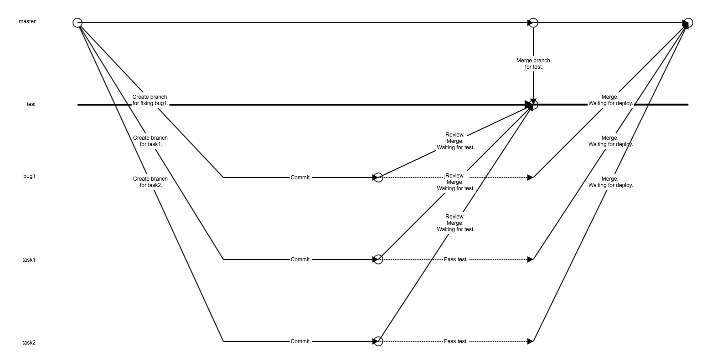

# Git Flow



## Rules

Master branch must always be ready to deploy.

Review code with "Pull request" function. Work Branch => Master Branch.
If the pull request pass reviewing.
Reviewer may set an "approve" status on the pull request.
But don't merge.

After the code pass test. Merge it.

## Step

```bash
# Pull new code for master branch.
git checkout master
git pull

# Create new branch for developing a feature or fixing a bug.
# Name of the branch should contain keywords of the featuer or bug.
# e.g. create a branch for new feature "teacher show".
git branch teacher-show
git checkout teacher-show
# Or simplified to:
git checkout -b teacher-show

# Develop and commit.
git add teacherShow.js
# Recommend to check all changes before commit.
git diff
# Or use GUI.
git gui
# Commit changes.
git commit
# Or simplified to:
git commit -m "New data struct for teacher show."
# DO NOT USE "-a". Because there is no reasons.

# Push your development branch to offical repository.
git push origin teacher-show:teacher-show
# DO NOT USE "--force" UNLESS YOU EXACTLY KNOW WHAT YOU ARE DOING.

# Then you can create a pull request for reviewing.

# Get ready for test.
# Do this on your local machine. Because it is good for solving conflicts.
git checkout test
git pull
git merge teacher-show
# Solve all conflicts if exists.
# Push test branch.
git push

# Deploy test branch on test server.
git checkout test
git pull
# Build, restart service or any other works.

# Testing successed. Received signal for online.
# Tagging only before doing online.
npm version major | minor | patch
# Or manual operation. Edit version in package.json(and package-lock.json if exists). Then use command like "git tag v1.2.3"
# Push code and tags.
git push && git push --tags
```

# Project Version Control

Control project version with [Sequence-based identifiers scheme](https://en.wikipedia.org/wiki/Software_versioning#Sequence-based_identifiers). Use git tag and the version of package.json to record the version.

major.minor.patch

> Semantic Versioning[1] is a formal convention for specifying compatibility using a three-part version number: major version; minor version; and patch. The patch number is incremented for minor changes and bug fixes which do not change the software's application programming interface (API). The minor version is incremented for releases which add new, but backward-compatible, API features, and the major version is incremented for API changes which are not backward-compatible. For example, software which relies on version 2.1.5 of an API is compatible with version 2.2.3, but not necessarily with 3.2.4.

--From [Wikipedia](https://en.wikipedia.org/wiki/Software_versioning#Sequence-based_identifiers)

## How

Use '[npm version](https://docs.npmjs.com/cli/version)' command to control version.

# Coding

## Rule NO.1: Readability is the most important thing.

Nowadays, computer systems are stronger too much than 90's.

Performance issues are easy to solve. But solving teamwork issues is like creeping in the hell.

Make sure that, any human can directly understand your thought, from your code.

## Naming

Anyone can understand the function or the use from the name.

Name should be used as [common knowledge](https://en.wikipedia.org/wiki/Common_knowledge_(logic)).

No acronym. Unless there are common acronym standards. Or the length of the name is longer then 20 characters.

Name of folder or file should be like name in code.
For example: If there is the user class in a file, name the file as 'User.js'.

Use lowerCamelCase for variables.

Use UpperCamelCase for classes.
If there is a thing. We use an object which is generated by the thing, instead of using the thing directly. We call the thing 'class'.

Use UPPER_CASE for constants(generalized).

## Syntax

No 'magic number' or 'magic string'.

Use [semicolon](https://github.com/tc39/ecma262/pull/1062/files) as you can.

Use trailing commas when declaring: JSON-style objects, arrays, and arguments of functions. Unless there are compatibility issues.

Write comments so that anyone can review or redevelop your code with high efficiency. Try using JSDoc if you can.

Use the same indentation style as other codes in one project.

Use 'let' and 'const' instead of 'var'.

Use 'if else' for helping describing high readability logic. 'Lazy return' is not recommended.
