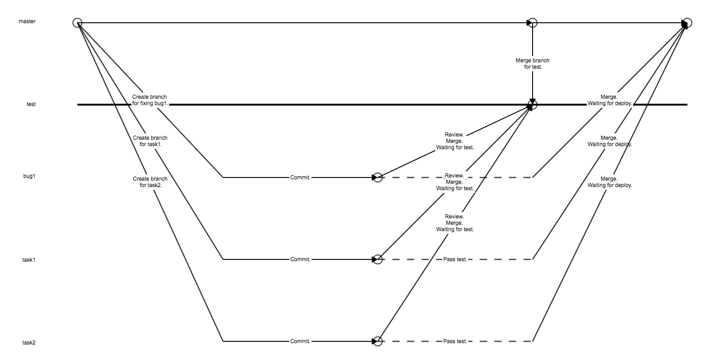

Master branch must always be ready for deploy.

The "bug" flow is only for emergency. Normal bug should be treated as a task.

Review with "Pull request" method. Task Branch => Test Branch. Bug Branch => Master Branch(Without merge).

